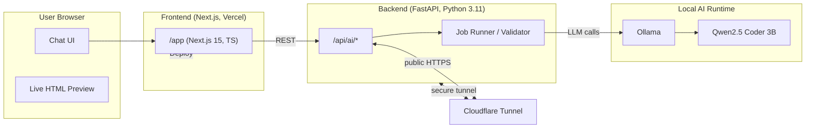

# AI Frontend Chat Service — Self‑Hosted, AI‑Driven Web Developer

[](https://www.python.org/)
[](https://fastapi.tiangolo.com/)
[](https://nextjs.org/)
[](https://www.typescriptlang.org/)
[](https://ollama.com/)
[](https://ollama.com/library/qwen2.5-coder)
[](https://developers.cloudflare.com/cloudflare-one/connections/connect-apps/)
[](https://vercel.com/)

> **One‑sentence value proposition:** A portfolio‑grade, production‑minded system that lets you build web pages with AI in a secure, self‑hosted stack — you own the model, the data, and the infrastructure.

This repository contains a **full‑stack AI product**:

- **Frontend**: Next.js (App Router, TypeScript) UI that behaves like a “nano‑Replit” — a chat interface where the assistant iteratively **generates and refines a single‑file HTML page** and renders it live.
- **Backend**: FastAPI service that orchestrates **Ollama** with **Qwen2.5‑Coder 3B**, validates outputs, and exposes a clean API (`/api/ai/...`) for job‑style generation.
- **Connectivity**: Secure public exposure via **Cloudflare Tunnel**, and easy frontend deployment on **Vercel**.
- **Testing**: Jest (frontend) and Pytest (backend).

The project demonstrates **senior full‑stack and AI engineering** practices: modular architecture, strict validation, job orchestration, deterministic prompts, environment isolation, and production‑ready operational concerns (CORS, TTL reaper, health/stats endpoints).

---

## Architecture (Mermaid)



---

## What it does

- Provides an **AI chat assistant specialized in frontend** that **returns a single, valid HTML5 document** per request.
- Enforces **strict output validation** (doctype, one `<html>/<head>/<body>`, no external assets, semantics checks).
- Implements **asynchronous, job‑based generation** with expiration and status tracking.
- Can run **end‑to‑end locally** or be **publicly reachable** via Cloudflare Tunnel. Frontend can be deployed to Vercel.

---

## Repos & structure

- `frontend/` — Next.js app (TypeScript).  
- `backend/` — FastAPI app (Python).

Each subproject has its own `README.md` with setup and operations guides.

---

## Quickstart (local, minimal)

> Prerequisites: Node.js 18+, Python 3.11+, Docker optional; Ollama installed with the **Qwen2.5‑Coder 3B** model pulled.

1. **Run Ollama locally** (first time pulls the model):
   ```bash
   ollama run qwen2.5-coder:3b
   ```

2. **Backend** (see `backend/README.md` for details):
   ```bash
   cd backend
   python -m venv .venv && source .venv/bin/activate  # Windows: .venv\Scripts\activate
   pip install -r requirements.txt
   uvicorn app.main:app --host 0.0.0.0 --port 8000
   ```

3. **Frontend** (see `frontend/README.md` for details):
   ```bash
   cd frontend
   npm install
   npm run dev
   ```

4. **Tunnel (optional, public HTTPS)**:
   ```bash
   cloudflared tunnel --url http://localhost:8000
   # Copy the provided trycloudflare URL and use it as BACKEND_BASE_URL for the frontend.
   ```

---

## Testing

- **Frontend**: `npm test` (Jest).  
- **Backend**: `pytest` (Pytest).

---

## Why this is portfolio‑grade

- **Self‑sovereign AI**: You run the model locally (Ollama) and control exposure (Cloudflare Tunnel). No vendor lock‑in.
- **Production posture**: CORS, health, stats, TTL reaper, deterministic prompts, robust validation.
- **Hiring signal**: Demonstrates **Senior Full‑Stack**, **Senior AI Engineer**, and **CTO‑level** system ownership: architecture, runtime strategy, and operational safety.
